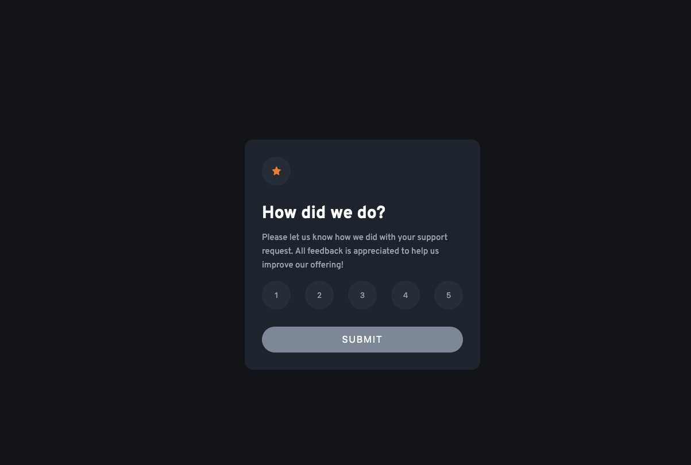

# Frontend Mentor - Interactive rating component solution

This is a solution to the [Interactive rating component challenge on Frontend Mentor](https://www.frontendmentor.io/challenges/interactive-rating-component-koxpeBUmI).

## Table of contents

- [The challenge](#the-challenge)
- [Screenshot](#screenshot)
- [Links](#links)
- [Built with](#built-with)
- [Author](#author)

### The challenge

Users should be able to:

- View the optimal layout for the app depending on their device's screen size
- See hover states for all interactive elements on the page
- Select and submit a number rating
- See the "Thank you" card state after submitting a rating

### Screenshot

### Links

- Live Site URL: [DEMO](https://dudnikgg.github.io/fe-course-bro/profiles/dudnikgg/rating-component)

### Built with

- Semantic HTML5 markup
- CSS3
- Flexbox
- Javascript
- Mobile-first workflow

## Author

